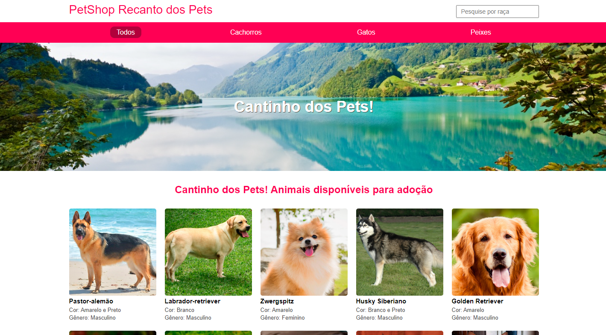

<h3>Projeto Acadêmico</h3>

# PetShop em NodeJS
Projeto PetShop feito em NodeJS

### Pré-requisitos globais:
"npm i -g nodemon typescript ts-node"

### Instalação
"npm install"

### Para rodar o projeto
"npm run start-dev"
